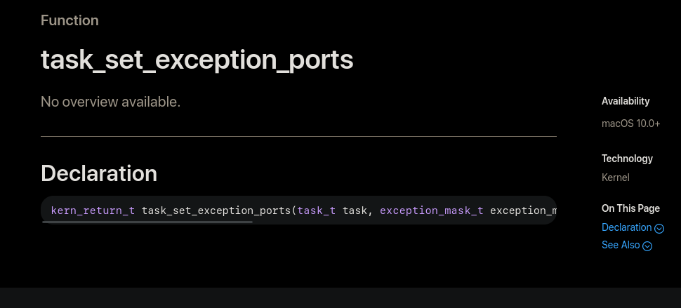
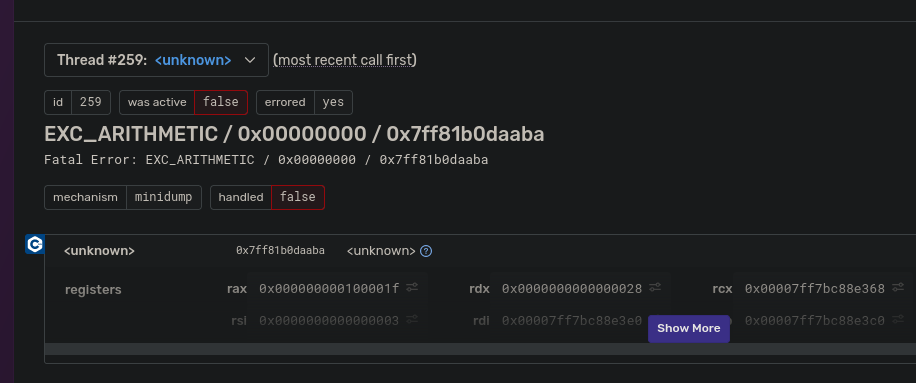
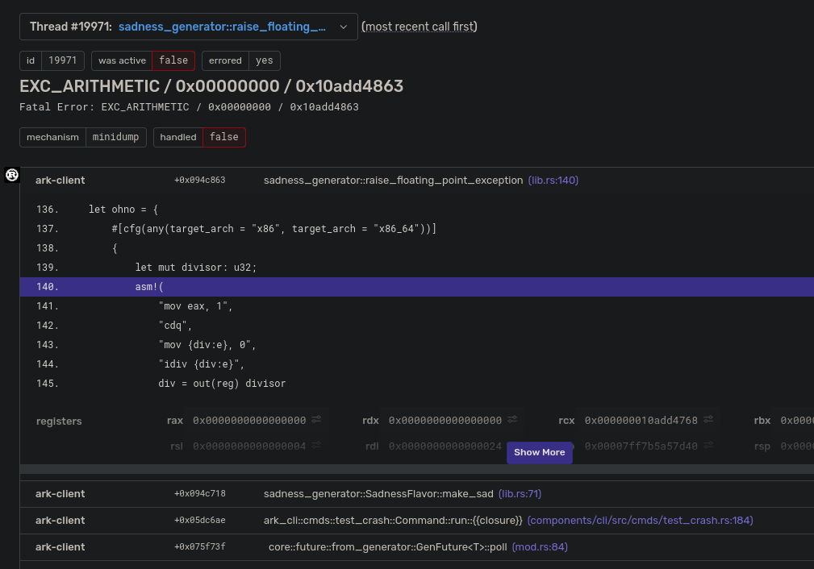

+++
title = "Crash reporting in Rust"
template = "page.html"
date = 2022-05-23

[taxonomies]
tags = ["linux", "android", "windows", "macos", "sentry", "rust"]
categories = ["code"]
+++

## Introduction

In this post I'll be talking about recent work I and others have done to make crash handling and reporting in Rust a (fairly) straightforward procedure by introducing several new crates that can be used in conjunction with each other, or with other crates you may already have. Keep in mind that some of the crates and details I'll be talking about might change as it is still early days, but the broad strokes _should_ stay true even if you're reading this blog post a couple of years in the future.

### Disclaimer

I'm going to be using some salty language in this post with regards to Apple, so fair warning if you are uncomfortable with that. I've tried to mostly keep it in a single rant section below that you can skip, but just wanted to give warning. Sorry, they just bring it out of me.

## Why we need crash reporting

Even though Rust has absolutely delivered on its promise of avoiding or eliminating entire classes of bugs and crashes (mostly at compile time!) that plague non-memory safe languages like C and C++, the truth is that crashes still happen in Rust projects.

One of the biggest sources for crashes in a Rust project is that, even if a vast majority of code is in Rust, it's almost certain you have at least a few dependencies with code written in C, C++, or even assembly, not even counting the giant dependency of your OS if you are targeting a non-embedded environment. And while the Rust ecosystem is [slowly](https://github.com/Byron/gitoxide) [rewriting](https://github.com/DoumanAsh/xxhash-rust) [C libraries](https://github.com/KillingSpark/zstd-rs) in Rust, this is a Sysiphean task.

The second most likely source of crashes is naturally `unsafe` code. Generally speaking, the biggest reason for `unsafe` in most projects is for bridging the gap between regular Rust code and the aforementioned non-Rust dependencies, which can itself be a source of [bugs/crashes](https://github.com/rust-lang/git2-rs/issues/813) on top of the foreign code it is interfacing with. In addition, `unsafe` is still needed for doing [operations](https://github.com/rust-lang/rust/blob/4ca19e09d302a4cbde14f9cb1bc109179dc824cd/library/core/src/slice/mod.rs#L1572-L1577) that normal Rust would not allow due to the restrictions of the language.

And even though the above potential sources of crashes will cover a vast majority of crash sources that can occur in a normal Rust program, the truth is that we as programmers just make mistakes that can make it past rustc, clippy, and whatever other processes could be in place to prevent them like static analysis and fuzzing, and crashes will occur that you want to know about so that you can fix them.

```rust
fn how_to_stack_overflow_with_one_weird_trick() {
    let mut big_boi = [0u8; 999 * 1024 * 1024];
    big_boi[big_boi.len() - 1] = 1;

    println!("{:?}", &big_boi[big_boi.len() - 20..]);
}
```

## Background

Some of you reading this post will immediately have thought about crash reporting solutions that already exist, and chances are fairly good that the set included [Breakpad](https://chromium.googlesource.com/breakpad/breakpad/) (and/or perhaps its younger sibling [Crashpad](https://chromium.googlesource.com/crashpad/crashpad/)). Even if you've never heard of these projects, it's almost guaranteed that you have been a passive user of them, as they are the backbone of crash reporting in Firefox and Chrome, and probably other software I'm unaware of. We'll just focus on Breakpad since it came first, and it's vastly simpler than its [over-engineered](https://en.wikipedia.org/wiki/Second-system_effect) (IMO) successor Crashpad.

Breakpad can essentially be broken down into two core innovations that were essential to its success. Keep in mind that Breakpad's first use case was browsers, so the following innovations, and the Rust crates we'll be detailing later, might not exactly fit your use case.

### Consistent generation

Most modern platforms have some kind of crash dump format that can be natively created when the OS detects a program has crashed. For Linux/BSD this is the [ELF core format](https://www.gabriel.urdhr.fr/2015/05/29/core-file/), for Windows it's the [minidump](https://docs.microsoft.com/en-us/windows/win32/debug/minidump-files), and for Mac it's...I guess either a `.crash` or in 12+ a `.ips`, neither which seem to have official documentation. Missing or poor documentation is a running theme in MacOS, as we'll see later.

While each platform's format can be analyzed/inspected with tools [native](https://docs.memfault.com/docs/mcu/coredump-elf-with-gdb/) to that system, and might even provide [application error reporting](https://docs.microsoft.com/en-us/windows/win32/wer/about-wer) as an OS service, the platform specific nature of the formats presents a massive burden if you want to support many platforms and process crashes that come from them systematically. So Breakpad instead opted to consolidate on the [minidump](https://docs.microsoft.com/en-us/windows/win32/debug/minidump-files) format for all the supported targets.

The reasoning behind this, from the [Breakpad docs](https://chromium.googlesource.com/breakpad/breakpad/+/master/docs/getting_started_with_breakpad.md) themselves, is straightforward.

> * Core files can be very large, making them impractical to send across a network to the collector for processing. Minidumps are smaller, as they were designed to be used this way.
> * The core file format is poorly documented. For example, the Linux Standards Base does not describe how registers are stored in PT_NOTE segments.
> * It is harder to persuade a Windows machine to produce a core dump file than it is to persuade other machines to write a minidump file. (ie, creating a minidump on Windows is a simple matter of invoking [MiniDumpWriteDump](https://docs.microsoft.com/en-us/windows/win32/api/minidumpapiset/nf-minidumpapiset-minidumpwritedump)
> * It simplifies the Breakpad processor to support only one file format.

### Consistent analysis

Once a minidump has been reported to some kind of service, the problem becomes one of analysis, at least in the original browser use case of Breakpad. That is to say, browser maintainers are (generally) less concerned with actually [debugging](https://docs.microsoft.com/en-us/windows/win32/dxtecharts/crash-dump-analysis#debugging-a-minidump-with-windbg) individual crashes themselves, but rather seeing high level information on a crash for grouping and triage purposes, principally provided by the stack trace for the thread that crashed, supplemented with other data that can be captured in a minidump.

This unfortunately runs into the immediate problem of needing debug symbols. Minidumps themselves don't contain any symbol information (or rather, they can, but generally don't) as that would massively increase the size, as well as requiring that debug symbols are available on the machine where the crash occurred, which is generally avoided by most applications due to download and installation size, in addition to some application wanting to avoid giving out a wealth of information most users won't need, but [malicious actors](https://www.unknowncheats.me/forum/battlefield-3-a/71032-bf3-pdb-836535-a.html) can take advantage of.

This presents an even thornier issue than that of platform specific crash formats, as debug formats are vastly more complicated and even more poorly documented. So, again, Breakpad opted to use a [single format](https://chromium.googlesource.com/breakpad/breakpad/+/HEAD/docs/symbol_files.md) that can be used to stackwalk and symbolicate a minidump, regardless of the source platform of the crash or the host platform of the processor. This format is vastly simpler and smaller than the native debug formats since it has the single goal of stack walking (in the case the binary has omitted [frame pointers](https://docs.microsoft.com/en-us/cpp/build/reference/oy-frame-pointer-omission?view=msvc-170)) and symbolicating (mapping addresses to source information eg. file, function, and line).

```text
MODULE windows x86 5A9832E5287241C1838ED98914E9B7FF1 test_app.pdb
FILE 1 c:\program files\microsoft visual studio 8\vc\platformsdk\include\winbase.h
FILE 2 c:\program files\microsoft visual studio 8\vc\include\typeinfo
FILE 3 c:\breakpad\trunk\src\common\windows\guid_string.h
...
FUNC 1000 13 4 vswprintf
1000 0 50 71
1000 12 51 71
1012 1 52 71
FUNC 1020 1b 10 wmemcpy_s
1020 0 1230 66
1020 1b 1233 66
FUNC 1040 1b 10 wmemmove_s
1040 0 1250 66
1040 1b 1253 66
FUNC 1060 19 4 std::bad_alloc::bad_alloc(char const *)
1060 13 371 83
1073 6 372 83
FUNC 1080 b 0 std::bad_alloc::~bad_alloc()
1080 6 380 83
1086 5 381 83
FUNC 1090 24 0 std::bad_alloc::`vector deleting destructor'(unsigned int)
FUNC 10c0 f 8 std::char_traits<wchar_t>::assign(wchar_t &,wchar_t const &)
10c0 0 302 70
10c0 e 303 70
10ce 1 304 70
...
PUBLIC 23b06 0 __from_strstr_to_strchr
FUNC 240b9 14 0 `operator new'::`6'::`dynamic atexit destructor for 'nomem''
STACK WIN 4 41b0 86 13 0 8 0 e0 0 1 $T0 $ebp = $eip $T0 4 + ^ = $ebp $T0 ^ = $esp $T0 8 + = $L $T0 .cbSavedRegs - = $P $T0 8 + .cbParams + =
STACK WIN 4 4240 41 3 0 18 0 0 0 1 $T0 $ebp = $eip $T0 4 + ^ = $ebp $T0 ^ = $esp $T0 8 + = $L $T0 .cbSavedRegs - = $P $T0 8 + .cbParams + =
STACK WIN 4 4290 18 4 0 0 0 4 0 1 $T0 $ebp = $eip $T0 4 + ^ = $ebp $T0 ^ = $esp $T0 8 + = $L $T0 .cbSavedRegs - = $P $T0 8 + .cbParams + =
...
```

The Rust crates I'll be detailing are only concerned with the first part of creating crash dumps, but Rust has a [rich](https://github.com/rust-minidump/rust-minidump/tree/main/minidump-processor) [set](https://github.com/getsentry/symbolic) of crates for dealing with minidumps already.

## Why not just...use Breakpad/Crashpad?

So this all seems fairly complicated, why could we not just use Breakpad from Rust? Well, we at Embark [did](https://github.com/EmbarkStudios/sentry-contrib-rust/tree/main/breakpad-handler) for a while! And it was "fine".

However, I wanted to transition to use [`x86_64-unknown-linux-musl`](https://musl.libc.org/) on all of our services a while back, so that we could get smaller container images for faster deploys. It turned out that Breakpad was our sole C++ dependency for our services (well, most of them, one depends on...[physx](https://github.com/EmbarkStudios/physx-rs) :cry:), which is annoying when targeting `musl`. It's a solvable problem, but apparently (ok, this happens often for me) I hit it on a day that made me [annoyed enough](https://perlbuzz.com/2008/02/15/annoyancedriven_development/) to start porting the Linux code to Rust so that we could at least get rid of the Breakpad dependency for that one target, at least initially.

I started doing the porting as a background task, and eventually ended up making a [comment](https://github.com/luser/rust-test-assembler/issues/12#issuecomment-960595876) that saved me a _ton_ of duplicated effort as it turned out folks at Mozilla were [already working](https://github.com/rust-minidump/minidump-writer) on replacing (parts of) [Breakpad with Rust](https://bugzilla.mozilla.org/show_bug.cgi?id=1588530)!

Not only were they already doing work in the area, but they had a more ambitious and nuanced set of reasons for doing this work than my initial "C++ is annoying and I want to get rid of it" that helped to inform the work I've been doing to this area recently. You can read Mozilla's documents around this area [here](https://docs.google.com/document/d/15c5ir55tgqHOexdyh5l2w0EO8k5QGvd6EEs6SUslOks), [here](https://docs.google.com/document/d/1xtGnn27iZYukhYOoC_TWo8koKeHfWBbxE7cNtkgSSUg) and [here](https://docs.google.com/document/d/198y2EgLkvWao0w31oVgOL9QiVKl8bEwBGM3g3hJTFQU), but here's a rough summary.

* Breakpad is barely maintained. Google is still the primary contributor, and their efforts have mostly been focused on Crashpad, and while Crashpad does have some improvements over Breakpad, it's also vastly more complicated and even worse than Breakpad in certain aspects
* Breakpad is a very old (at least relative to most OS projects) codebase and includes a fair amount of code that is obsolete. For example, Apple has not supported PowerPC since MacOS 10.6, which was released over a decade ago, but Breakpad still has [code](https://github.com/google/breakpad/blob/0808030bee8bc88a34675cd1dd83b965a2249a08/src/client/mac/handler/minidump_generator.cc#L638-L702) for it.
* Breakpad, as with most C++ projects, is essentially a monolith, which makes it difficult to integrate if you want to do something slightly different from how Breakpad wants things to be done. This is one of the aspects that Crashpad is even worse in, as, for example, it "helpfully" includes the actual sending of minidumps to a remote HTTP server, forcing a dependency on `OpenSSL` which we've explicitly [banned](https://github.com/EmbarkStudios/cargo-deny) as we use `rustls` unilaterally. Also being a monolith, it includes [bits of code](https://github.com/google/breakpad/blob/0808030bee8bc88a34675cd1dd83b965a2249a08/src/common/md5.cc) that in a Rust project would most likely be implemented in a crate shared with other pieces of your codebase.

With those deficiencies in mind we can come up with a couple of high level goals for a rewrite.

### Modular

Rather than going the Breakpad/Crashpad route of having a single large project to integrate, perhaps [giving basic control](https://github.com/google/breakpad/blob/0808030bee8bc88a34675cd1dd83b965a2249a08/src/client/linux/handler/exception_handler.h#L76-L114) over how crash handling is done, instead provide several crates, each focused on a specific aspect in this larger area that can be used together, or even independently.

For example, you may want to catch crashes when they occur, but instead of creating a minidump, throw up a dialog saying you are very sorry before your program exits. Or maybe (like us at Embark), you want to report minidumps to [Sentry](https://sentry.io) and include not only the minidump, but also the normal event data such as [breadcrumbs](https://docs.sentry.io/product/issues/issue-details/breadcrumbs) and [tags](https://docs.sentry.io/product/issues/issue-details/#tags).

### Clean

Being a rewrite of an older codebase, we get the opportunity to just ignore porting obsolete or redundant (when available in an existing Rust crate) pieces of code, reducing the size and complexity of the project. A lot of cruft has accumulated over the years in the Breakpad codebase, especially for platforms like MacOS for _reasons_ I'll get to later.

## Implementation

So now that we're porting Breakpad to Rust, what are the pieces that we actually need to have, as a minimal first pass implementation (ie, the current state of this effort)? To answer that question we actually need to decide on one critical detail for the crash handler, which is whether it supports **in-process** crash dumping (creating/sending a minidump in the same process that crashed), **out-of-process** crash dumping (creating/sending a minidump from a separate process than the one that crashed), or both.

For context, Breakpad supports both in-process and out-of-process dumping, while Crashpad supports only out-of-process dumping. in-process has the advantage that it's _somewhat_ easier to support as there is no need for process management or IPC communication, but comes at a severe disadvantage, notably that it is just not as reliable as out-of-process dumping. The reason for this is simply that, when a crash occurs, fairly complicated code needs to run to capture the state of a program. For some crashes, such as say, a [divide by zero](https://docs.rs/sadness-generator/0.1.0/sadness_generator/enum.SadnessFlavor.html#variant.DivideByZero) on `x86_64`, capturing the program state will most likely be fine. However, this gets more complicated for things like segmentation faults, as the cause _might_ be a simple dereference of a `null` pointer...but it could also be because some code has stomped over some memory, and while a crash has occurred now, there's no guarantee that other memory hasn't also been stomped, including really critical regions, such as, say, where your heap allocator maintains some state. Breakpad has a [non-trivial amount](https://github.com/google/breakpad/blob/main/src/common/memory_allocator.h) of code on Linux and [MacOS](https://github.com/google/breakpad/blob/main/src/client/mac/handler/protected_memory_allocator.h) to _try_ to handle those kinds of severe scenarios, but the truth is that the more code you run in a crashing process, the more likely it is fail, regardless of the precautions and mitigations. And that's to say nothing of Windows.

> Minidumps for main process crashes are written in the crashed process, this is notoriously buggy on Windows. We’re missing crashes because of it. - [Mozilla](https://docs.google.com/document/d/1xtGnn27iZYukhYOoC_TWo8koKeHfWBbxE7cNtkgSSUg)

I had initially started down the path of supporting in-process dumping as we had been using that already via our Breakpad wrapper, mainly due to convenience. Frankly, the code was kind of [fun](https://github.com/EmbarkStudios/sentry-contrib-rust/commit/7fedcbffd2230f8aaee41d35622ebf29221994d7) to write (well [mostly](https://github.com/EmbarkStudios/sentry-contrib-rust/commit/20c2883478818e341170b0cfc49141d203783dba#diff-281d2fdeea972facd303c135135513ec97b57d43ff8d5b1f244f85f9a0efef83R111-R113), Rust still doesn't have [stable](https://github.com/rust-lang/rust/issues/32838) [Allocators](https://github.com/EmbarkStudios/sentry-contrib-rust/commit/07373b7667764d58904ea981f80734743d6b6d85) :sad:), however [reason](https://github.com/luser/rust-test-assembler/issues/12#issuecomment-963059409) prevailed and I decided to go all in on out-of-process dumping. This means that in-process dumping is possible with the set of crates I'll be detailing, but is not going to be nearly as reliable, which is of course problematic for platforms that don't support process creation from user space (such as consoles).

The implementation details we'll be talking about have been built and tested for Linux (Android compiles, but is untested), Windows, and MacOS. BSD should be able to be supported _fairly_ easily as it shares a lot in common with both Linux and MacOS (PRs welcome!). iOS is...ugh. At Embark we don't actually care about iOS since its various platform and app restrictions make it impossible for us to release our Rust project on it, and it's also uninteresting to Mozilla because [reasons](https://www.theregister.com/2022/04/26/apple_ios_browser/), but again, PRs welcome!

### [crash-handler](https://github.com/EmbarkStudios/crash-handling/tree/main/crash-handler)

The first component that we need is, well, a way to actually know when a crash has occurred! Each platform has its own special way to inform users of crashes or other exceptional events, but the crate provides a simple callback to the user when a crash occurs that is the same across platforms, other than that the actual [`CrashContext`](https://docs.rs/crash-context/latest/crash_context/struct.CrashContext.html) itself is platform specific.

```rust
/// The result of the user code executed during a crash event
pub enum CrashEventResult {
    /// The event was handled in some way
    Handled(bool),
    #[cfg(not(target_os = "macos"))]
    /// The handler wishes to jump somewhere else, presumably to return
    /// execution and skip the code that caused the crash
    Jump {
        /// The location to jump back to, retrieved via sig/setjmp
        jmp_buf: *mut jmp::JmpBuf,
        /// The value that will be returned from the sig/setjmp call that we
        /// jump to. Note that if the value is 0 it will be corrected to 1
        value: i32,
    },
}

pub unsafe trait CrashEvent: Send + Sync {
    /// Method invoked when a crash occurs.
    fn on_crash(&self, context: &CrashContext) -> CrashEventResult;
}
```

In addition, a method is provided to explicitly signal a crash to take advantage of the same flow and context information available when a real crash occurs, for cases in which a program wishes to capture its current state, for example, you might have application specific code that determines when it has entered a "hung" state that you might want to capture and report.

#### Linux (and BSD)

* `SIGABRT`
* `SIGBUS`
* `SIGFPE`
* `SIGILL`
* `SIGSEGV`
* `SIGTRAP`

Linux sends [signals](https://man7.org/linux/man-pages/man7/signal.7.html) to registered [signal handlers](https://man7.org/linux/man-pages/man2/sigaction.2.html) when they are raised, either by the kernel, or by [user code](https://man7.org/linux/man-pages/man3/raise.3.html). Signal handling is...kind of complicated with various edge cases and caveats, and I've mostly relied on doing a straight port of the original Breakpad C code to Rust to handle these intricacies, as there are a few workarounds for dealing with [platform issues](https://github.com/EmbarkStudios/crash-handling/blob/42e32f6f2c86f7a551af54726891a4fdc902f43e/crash-handler/src/linux/state.rs#L148-L171) and [buggy user code](https://github.com/EmbarkStudios/crash-handling/blob/42e32f6f2c86f7a551af54726891a4fdc902f43e/crash-handler/src/linux/state.rs#L300-L332) that means we can save ourselves pain in the future.

However, there is an additional wrinkle if we want to support users raising their own signals, and that wrinkle is named [`getcontext`](https://man7.org/linux/man-pages/man3/getcontext.3.html). `getcontext` is a POSIX function that retrieves the CPU context (essentially, the register contents) for the calling thread, and it's been deprecated for over a decade. This means that libc implementations can just...not support it, and still be POSIX compliant, one of which is [`musl`](https://wiki.musl-libc.org/open-issues.html). But while I was in the middle of implementing this stuff, Rust 1.59.0 dropped, which added stable support for [inline assembly](https://blog.rust-lang.org/2022/02/24/Rust-1.59.0.html#inline-assembly)...so I just took a page from Breakpad/libunwind and added [an implementation](https://github.com/EmbarkStudios/crash-handling/tree/main/crash-context/src/linux) sufficient for the needs of this project.

There is also another major issue particular to signal handling, which is that, by default, signal handlers are called on the same stack where the crash occurred, which is problematic if that crash happens to be due to a [stack overflow](https://en.wikipedia.org/wiki/Stack_buffer_overflow). Specifically for this case, when registering a signal handler you can specify that they will use an [alternate stack](https://man7.org/linux/man-pages/man2/sigaltstack.2.html) when handling a signal. Unfortunately, this is a per-thread attribute, meaning if a stack overflow occurs on a thread without an alternate signal stack installed, we'll miss the crash. However, we're in luck! Rust already [installs](https://github.com/rust-lang/rust/blob/a084b7ad35adb508bd2e053fc2a1b9a53df9536c/library/std/src/sys/unix/thread.rs#L106) an [alternate stack](https://github.com/rust-lang/rust/blob/33fd73fedeb5cd61dbbb7562fd927c0b6994653a/library/std/src/sys/unix/stack_overflow.rs) for every [`std::thread::Thread`](https://doc.rust-lang.org/std/thread/struct.Thread.html), so we're good! I actually thought that as well, but then was helpfully reminded that [we also need to handle threads created from non-Rust](https://github.com/EmbarkStudios/crash-handling/issues/4) code. Luckily Firefox already had a [simple](https://hg.mozilla.org/mozilla-central/file/3cf2b111807aec49c54bc958771177d33925aace/toolkit/crashreporter/pthread_create_interposer/pthread_create_interposer.cpp) [`pthread_create`](https://man7.org/linux/man-pages/man3/pthread_create.3.html) [interposition](https://www.geeksforgeeks.org/function-interposition-in-c-with-an-example-of-user-defined-malloc/) that I [ported to Rust](https://github.com/EmbarkStudios/crash-handling/blob/d48e8a94566180b36bce4024bf578bbed74e7674/crash-handler/src/unix/pthread_interpose.rs), with a small addition to support [musl](https://github.com/EmbarkStudios/crash-handling/blob/d48e8a94566180b36bce4024bf578bbed74e7674/crash-handler/src/unix/pthread_interpose.rs#L67-L70). This means that adding `crash-handler` as a dependency will automatically add an alternate signal stack for all threads, regardless of where they are created. I can also see how this is also a bit, shall we say, :eyes:, so I might end up putting this behind a feature flag if people are uncomfortable having the function interposition.

#### Windows

Windows basically boils down to calling [`SetUnhandledExceptionFilter`](https://docs.microsoft.com/en-us/windows/win32/api/errhandlingapi/nf-errhandlingapi-setunhandledexceptionfilter) with a function you want to called whenever an exception/crash occurs, which is definitely a welcome simplicity after Linux.

Breakpad also registers two other error handlers exclusive to Windows, which are [`_set_invalid_parameter_handler`](https://docs.microsoft.com/en-us/cpp/c-runtime-library/reference/set-invalid-parameter-handler-set-thread-local-invalid-parameter-handler?view=msvc-170), called when supplying invalid arguments to CRT (libc) functions eg. `printf(nullptr);`, and [`_purecall`](https://docs.microsoft.com/en-us/cpp/c-runtime-library/reference/purecall?view=msvc-170), called when C++ code tries to invoke a pure virtual function. The effort to support these was minimal so I ported them as well, even though Crashpad seemed to not think they were useful enough to support.

There is one big difference from the original Breakpad code though, and that is that I opted (for now) not to support **abort** handling. On Windows there is limited support for signals, including `SIGABRT`, which is raised by eg [abort](https://en.cppreference.com/w/c/program/abort) or [std::abort](https://en.cppreference.com/w/cpp/utility/program/abort). However, Rust's [std::process::abort](https://doc.rust-lang.org/std/process/fn.abort.html) uses [`__fastfail`](https://docs.microsoft.com/en-us/cpp/intrinsics/fastfail?view=msvc-170) on Windows, which does not raise `SIGABRT`. This drastically reduces the usefulness of handling `SIGABRT` on Windows in a (primarily) Rust codebase, but it can be added easily in the future if needed.

#### MacOS

* `EXC_BAD_ACCESS` = `SIGSEGV` | `SIGBUS`
* `EXC_BAD_INSTRUCTION` = `SIGILL`
* `EXC_ARITHMETIC` = `SIGFPE`
* `EXC_BREAKPOINT` = `SIGTRAP`
* `SIGABRT`

Being a Unix, one would assume that MacOS would also just use signals, and indeed, you can do just that. However, signals are not really the native way MacOS reports crash/exception events to user code, but rather a fallback mechanism that is used if the user hasn't registered interest via the native way, which are [exception ports](https://flylib.com/books/en/3.126.1.109/1/).

This little section is where I am going to rant about Apple, and how they made doing the MacOS parts of the `crash-handler` and all of the other code that I will talk about in the rest of this post harder than it needed to be, in all of the wrong, non-fun ways. Feel free to [skip this section](#post-rant).

:salt: **/begin rant** :salt:

You may be thinking, "why aren't you linking to Apple's official documentation for what exception ports are, or maybe the API specific documentation?" And trust me, nothing would have made me happier than to link to official documentation similarly to what I've done for Linux and Windows above. The problem is that there is none.

Now, to be clear, before I started porting the MacOS Breakpad code to Rust, I had managed to successfully dodge needing to know any Mac/Apple specifics because I've mostly worked in traditional (non-mobile) game development in my career, and therefore never worked on a project that targeted an Apple device, up until the project I work on now. I do manage our Apple CI machines, so I know that XCode fucking sucks, homebrew is terrible, and Apple's complete lack of support for virtualization would be laughable if it wasn't such a giant pain in the ass for literally every project that wants to have basic automation for Apple targets.

For example, here is the official Apple "API documentation" for [`task_set_exception_ports`](https://developer.apple.com/documentation/kernel/1538049-task_set_exception_ports) which is the closest equivalent to Windows' [`SetUnhandledExceptionFilter`](https://docs.microsoft.com/en-us/windows/win32/api/errhandlingapi/nf-errhandlingapi-setunhandledexceptionfilter).

<p align="center"></p>

The first time I encountered this "documentation" I figured I had just been unlucky and stumbled upon the one function that Apple had neglected to document. Their kernel is large, mistakes can happen! But no, this turns out to actually be the rule for Apple's documentation, the exceptions are the ones that actually have [any](https://developer.apple.com/documentation/kernel/1523490-vfs_fsadd) documentation at all.

Now, at this moment, [Apple's market capitalization](https://companiesmarketcap.com/apple/marketcap/) is **$2.415 Trillion** so obviously this is not due to lack of resources, but rather will. So let's give Apple the benefit of the doubt and assume that they don't want us to use these APIs because they're "internal", maybe analogous to the undocumented [`Nt*`](http://undocumented.ntinternals.net/) functions in Windows, which Microsoft purposefully doesn't provide public documentation or support for so that they can change or remove them whenever they want, while still preserving their infamous backwards compatibility.

Unfortunately this argument falls flat immediately due the nature of what Apple leaves undocumented, notably [Mach ports](https://docs.darlinghq.org/internals/macos-specifics/mach-ports.html).

Like I said before, I had basically no knowledge of MacOS specifics before doing this port, so it was an unpleasant shock to learn that Mach ports are essentially a core primitive of [XNU](https://en.wikipedia.org/wiki/XNU), with, AFAICT a [single high level overview](https://developer.apple.com/library/archive/documentation/Darwin/Conceptual/KernelProgramming/Mach/Mach.html) available from Apple. Mach ports back every process (task) and thread in MacOS, and are the IPC mechanism used to communicate between kernel and user space. _All_ of the code that was ported to Rust relies on them and the functions that interact with them, **none** of which are documented, beyond reading the actual kernel source code, which is itself not well documented.

Another argument that could be made would be that "you're doing it wrong by using Rust/C instead of Objective-C/Swift, Apple wants you to use their preferred application language, those APIs are well documented and supported!" Here is the documentation for [`NSUncaughtExceptionHandler`](https://developer.apple.com/documentation/foundation/nsuncaughtexceptionhandler?language=objc). Wait let me save you the trouble of clicking

> No overview available.

But wait, there is documentation for [`NSException`](https://developer.apple.com/documentation/foundation/nsexception?language=objc)! I'm fairly sure this cannot be used to catch actual crashes, but that's just a guess because even when Apple bothers to document their own APIs, they don't do it well, at least relative to, say Microsoft, a company that actually cares about documentation and developer experience (to a degree..._stares at Visual Studio_).

But even _if_ Swift or Objective-C exposed the APIs we need to catch crashes and write a minidump for them (AFAICT they don't)...why would the easy path be to use a different language to interface with a kernel written in C? This would be like Microsoft only documenting how to use [NamedPipes](https://docs.microsoft.com/en-us/dotnet/standard/io/how-to-use-named-pipes-for-network-interprocess-communication) if you used C#, but not via [C](https://docs.microsoft.com/en-us/windows/win32/ipc/multithreaded-pipe-server), which then makes it possible to use them via any language that can use FFI to call C code (ie, almost every non-toy language in existence).

In conclusion, this means while doing the port I gleaned more useful information from [random blog posts](https://fdiv.net/2019/08/17/making-mach-server) than from Apple's own documentation.

<div align="center">

```text
______          _    _               _____          _                                  _             
|  ___|        | |  (_)             |  ___|        | |                                (_)            
| |_ _   _  ___| | ___ _ __   __ _  | |__ _ __ ___ | |__   __ _ _ __ _ __ __ _ ___ ___ _ _ __   __ _ 
|  _| | | |/ __| |/ / | '_ \ / _` | |  __| '_ ` _ \| '_ \ / _` | '__| '__/ _` / __/ __| | '_ \ / _` |
| | | |_| | (__|   <| | | | | (_| | | |__| | | | | | |_) | (_| | |  | | | (_| \__ \__ \ | | | | (_| |
\_|  \__,_|\___|_|\_\_|_| |_|\__, | \____/_| |_| |_|_.__/ \__,_|_|  |_|  \__,_|___/___/_|_| |_|\__, |
                              __/ |                                                             __/ |
                             |___/                                                             |___/ 
```

</div>

:salt: **/end rant** :salt:

#### Post-rant

Wait, where were we? Oh right, exception ports.

However, signals are not really the native way MacOS reports crash/exception events to user code, but rather a fallback mechanism that is used if the user hasn't registered interest via the native way, which are [exception ports](https://flylib.com/books/en/3.126.1.109/1/).

We use `task_swap_exception_ports` to register a task level exception handler, which will receive an exception message if an [exception](https://github.com/EmbarkStudios/crash-handling/blob/42e32f6f2c86f7a551af54726891a4fdc902f43e/crash-handler/src/mac/state.rs#L29-L33) we care about is thrown. This allows the crash-handler to be integrated with code that might already be using [thread exception ports](https://github.com/bytecodealliance/wasmtime/blob/c8f55ed688ad733dee333f23e51b108e0cb9b41b/crates/runtime/src/traphandlers/macos.rs), as ports are executed in the order of `thread` -> `task` -> `host`. If a port isn't registered at any level, the default exception port for a task is to convert the Mach exception to a Unix signal as mentioned previously, though at the loss of some information. This means that if there is code that _is_ registering handlers for signals such as `SIGSEGV`, they **won't be executed** any longer as the exception ports take precedence, which might [be a problem](https://github.com/bytecodealliance/wasmtime/issues/2456).

In addition, MacOS, much like Windows, does not have an exception for when user code aborts a process, so we register a single signal handler for `SIGABRT`, just as Breakpad does.

One additional note is that since exceptions are delivered via ports, aka IPC, it is possible to register an exception port for an entirely different process and be notified when it crashes. I opted not to go this route to keep the MacOS implementation as close to the Linux and Windows one as I could, since there is already a lot of platform specifics going on without adding completely different code flows on top of it.

### [minidumper](https://github.com/EmbarkStudios/crash-handling/tree/main/minidumper)

As stated before, the focus, at least for this initial implementation pass, is on out-of-process crash handling. That means if we want to create a minidump, we need to communicate the crash context from the crashing process to separate process that can take care of those details.

The `minidumper` crate was made to make that IPC communication between a crashing process and a monitor process fairly easy, providing a simple API to integrate into new or existing applications that want to catch and handle crashes. In `crash-handler` I hewed fairly closely to the original Breakpad code, but the IPC communication is wildly different for several reasons.

#### User messages

In Breakpad, the IPC code is used for exactly 1 thing, the client (crashing process) requesting a minidump be generated by the server (monitor) process. This is the simplest approach, but is, for what we at Embark (and, I'm assuming, others) want out of a crash reporting mechanism, too simple.

To reiterate, we use [Sentry](https://sentry.io) as our error reporting solution. While it supports just sending minidumps and does the handling of them by symbolicating all the thread callstacks and pulling out eg. system information, there is a _much_ richer set of details that we could provide that fall outside of the baseline information usually contained in a minidump, though that being said, minidumps are a flexible format with support for abitrary user data. One example of richer information that we would want to send along with a crash is [breadcrumbs](https://docs.sentry.io/product/issues/issue-details/breadcrumbs/). Breadcrumbs are essentially just the last `n` trace events, and can be incredibly useful for diagnosing issues. For example, our primary project is a frame-based application, which could mean that a crash's root cause might have been indicated by a (seemingly) innocuous warning message 1 or more frames previously than in the frame in which the crash actually occurred.

And, going back to the `crash-handler`, it's recommended to do as **little work** as possible when handling a crash, which for us means that the monitor process is not only responsible for capturing the minidump, but also sending it to Sentry, so we want all of that additional information available in the monitor process at the time of the crash.

Our scenario led me to believe that most projects that might want to integrate crash reporting would want some way to do something similar, sending application specific information to the crash monitor process so that in the eventuality of a crash, the minidump can be accompanied by richer and more detailed information.

#### IPC implementation

Each platform supported by Breakpad uses a platform-specific IPC mechanism: Linux uses [Unix Domain Sockets](https://en.wikipedia.org/wiki/Unix_domain_socket), Windows uses [Named Pipes](https://docs.microsoft.com/en-us/windows/win32/ipc/named-pipes), and MacOS uses (ugh) Mach ports.

I started the port by targeting Linux so naturally the UDS method was kept, though slightly modified to use abstract addresses via the excellent [uds](https://docs.rs/uds/latest/uds/) crate, which was all nice and easy.

Then came Windows. :cry:

If you are _only_ targeting Windows, Named Pipes are, I suppose, an _ok_ way to do IPC. However, if you target anything else, they make sharing code between the targets practically impossible due their _wildly_ different API compared to sockets or even files. My initial pass at supporting Windows used them, but there was a bug somewhere with polling and they weren't working correctly. I was already annoyed that the code was so different from the nice and simple UDS version, I decided to go an alternate route and just...use [Unix Domain Sockets](https://devblogs.microsoft.com/commandline/af_unix-comes-to-windows/)! Unfortunately though, Windows doesn't support ancillary data, `SOCK_SEQPACKET`, nor abstract addresses like Linux. This comes at the cost of needing to create an actual file on disk and manually clean it up later, but gives us the benefit of a _much simpler_ implementation that can share a bulk of the same code with Linux. It does come with the caveat that we've now limited support to [Windows 10.17063+](https://blogs.windows.com/windows-insider/2017/12/19/announcing-windows-10-insider-preview-build-17063-pc/), but that's over 4 years old at this point, and this is a greenfield project, so...

```rust
match self.listener.accept_unix_addr() {
    Ok((accepted, _addr)) => {
        let key = id;
        id += 1;

        poll.add(&accepted, Event::readable(key))?;

        log::debug!("accepted connection {}", key);
        clients.push(ClientConn {
            socket: accepted,
            key,
            #[cfg(target_os = "macos")]
            pid: None,
        });

        if handler.on_client_connected(clients.len()) == LoopAction::Exit {
            log::debug!("on_client_connected exited message loop");
            return Ok(());
        }
    }
    Err(err) => {
        log::error!("failed to accept socket connection: {}", err);
    }
}

// We need to reregister interest every time
poll.modify(&self.listener, Event::readable(0))?;
```

Following this nice win on Windows, I foolishly assumed that MacOS would be even easier, but as we've learned, MacOS is a giant pain the ass, and it doesn't disappoint here either. I got UDS working on MacOS, and was catching crashes and successfully generating minidumps for them in the [minidumper tests](https://github.com/EmbarkStudios/crash-handling/tree/42e32f6f2c86f7a551af54726891a4fdc902f43e/minidumper-test), nice! Then I integrated my changes into our project and emitted a few crash dumps to Sentry for sanity checking and immediately noticed the crash reports were...not good.

<p align="center"></p>

I assumed that I had done something wrong in the minidump writing and started adding some diagnostic code and extra validation to try and figure out what was going on, but nothing really stood out. I can't remember exactly how long I spent trying to figure this out but I eventually added enough diagnostic code to turn up something odd, `mach_task_self`, which is used to get the id of the current task similar to `std::process::id` is used to get the PID of the process, was returning the same ID in both the process that crashed, and the process that was generating the minidump.

WTF.

Now, people who have knowledge about MacOS are probably thinking, "you idiot, of course that's not how `mach_task_self` works!", but in my defense, Apple sucks, as, "fun fact", `mach_task_self` is not even listed on [Apple's "documentation"](https://developer.apple.com/search/?q=mach_task_self), not that it matters, since we all know they wouldn't have actually had any documentation for it. I needed to find this random snippet from [Mac OS X Internals](https://books.google.se/books?id=K8vUkpOXhN4C&pg=PA577&lpg=PA577&dq=mach_task_self&source=bl&ots=ONmhYW_s1D&sig=ACfU3U30VoOBwZ1ILTEzVBChP9BMgTsgJw&hl=en&sa=X&ved=2ahUKEwj_zpSulOv3AhVjkosKHSPLAqoQ6AF6BAgfEAM#v=onepage&q=mach_task_self&f=false) to see that I had misunderstood the API.

> The value returned from `task_self_trap()` is not a unique identifier like a Unix process ID. In fact, its value will be the same for all tasks, even on different machines, provided the machines are running identical kernels.

So it turns out my simplification to completely replace the Mach ports IPC with UDS was fundamentally flawed. The Mach IPC code is not only doing transmission, it's also [checking permissions](https://bazad.github.io/2018/10/bypassing-platform-binary-task-threads/) and, most importantly, converting port identifiers to be...actually useful when used by another process. While I _think_ it is probably possible to do all of this in userspace, I was too irritated to want to spend more time on this figuring out stupid issues that could be easily avoided if not for Apple's laziness and condescension, so I just opted for the rather ugly solution of

<p align="center"></p>

This means that any user messages are sent via the regular socket just the same as Linux and Windows, but when sending a crash context, we fallback to using `mach_msg` (why did Apple feel that using a single function for both sending and receiving was a good idea, and don't even get me started on MIG). This makes the code significantly uglier, but it does work!

<p align="center"></p>

I _believe_ it will be possible to remove this ugliness in the future after my tolerance for Apple's ~bullshit~ carelessness has increased (or some kind person who knows MacOS sends a PR!), but for now, it works.

### [minidump-writer](https://github.com/rust-minidump/minidump-writer)

The final big piece that we need to bring this all together is, well, the actual minidump generation. As previously stated, since minidumps are the native format for Windows, the Windows implementation is _basically_ just a single call.

```rust
// Write the actual minidump
// https://docs.microsoft.com/en-us/windows/win32/api/minidumpapiset/nf-minidumpapiset-minidumpwritedump
// SAFETY: syscall
let ret = unsafe {
    md::MiniDumpWriteDump(
        self.crashing_process, // HANDLE to the process with the crash we want to capture
        self.crashing_pid,     // process id
        destination.as_raw_handle() as HANDLE, // file to write the minidump to
        md::MiniDumpNormal,    // MINIDUMP_TYPE - we _might_ want to make this configurable
        exc_info
            .as_ref()
            .map_or(std::ptr::null(), |ei| ei as *const _), // exceptionparam - the actual exception information
        &user_stream_infos, // user streams
        std::ptr::null(),   // callback, unused
    )
};
```

Other platforms are....slightly more complicated.

Minidumps are kind of a general container format, with multiple different streams of information that are (mostly) isolated from each other. Essentially, what each non-Windows platform needs to do to fill out information in a minidump is to inspect the state of the process, similarly to a debugger. For Linux this is mostly done with [`ptrace`](https://man7.org/linux/man-pages/man2/ptrace.2.html), and for MacOS it's (shocking!) a bunch of undocumented APIs. Luckily the Breakpad authors have already done the hard work of writing a C++ implementation that we can mostly directly port from.

#### [Modules](https://docs.rs/minidump-common/latest/minidump_common/format/enum.MINIDUMP_STREAM_TYPE.html#variant.ModuleListStream)

This stream contains a list of [MINDUMP_MODULE](https://docs.rs/minidump-common/latest/minidump_common/format/struct.MINIDUMP_MODULE.html), 1 for each dynamically loaded library in the process. Each module contains a few pieces of critical information that is needed to make other streams useful during analysis.

* `base + size` - The load address information is used during symbolication to know which instruction address corresponds to which module
* `cv_record` - The [debug identifier](https://docs.rs/debugid/latest/debugid/struct.DebugId.html) for the module. This is how a minidump processor can retrieve the debug symbols associated with a module to symbolicate an instruction address to get its source information eg file, function, and line
* `name` - The human readable name of the dynamic library. This is not strictly needed, but nice to have.

#### [Threads](https://docs.rs/minidump-common/latest/minidump_common/format/enum.MINIDUMP_STREAM_TYPE.html#variant.ThreadListStream)

A list of [MINIDUMP_THREAD](https://docs.rs/minidump-common/latest/minidump_common/format/struct.MINIDUMP_THREAD.html), 1 for each of the currently running threads in the crashed process. Each thread contains two important pieces of information, the CPU context, ie register state, of the thread, and a block of the thread's stack memory. This information can be used by a minidump processor to generate a stack trace for each thread, possibly symbolicating each stack frame if debug symbols are available.

#### [Memory](https://docs.rs/minidump-common/latest/minidump_common/format/enum.MINIDUMP_STREAM_TYPE.html#variant.MemoryListStream)

This is a stream for storage of raw blocks of memory that can be referenced by other streams. This is currently only used for the thread stack memory on MacOS, but on Linux is additionally used if an application wants to add its own blocks of memory.

#### [Exception](https://docs.rs/minidump-common/latest/minidump_common/format/enum.MINIDUMP_STREAM_TYPE.html#variant.ExceptionStream)

This is the stream that contains the actual high level metadata for cause of the crash, like the signal, exception code, fault address etc.

#### [SystemInfo](https://docs.rs/minidump-common/latest/minidump_common/format/enum.MINIDUMP_STREAM_TYPE.html#variant.SystemInfoStream)

This stream contains various bits of system information such as CPU details and the OS/kernel version.

#### [MiscInfo](https://docs.rs/minidump-common/latest/minidump_common/format/enum.MINIDUMP_STREAM_TYPE.html#variant.MiscInfoStream)

The stream where things that weren't part of the original implementation gets shoved into, as shown by the fact this has 5 different versions at the time of writing. This can include information like process uptime and (oddly) the CPU frequency, even though one would think that would be part of the aforementioned SystemInfo. :shrug:

#### [BreakpadInfo](https://docs.rs/minidump-common/latest/minidump_common/format/enum.MINIDUMP_STREAM_TYPE.html#variant.BreakpadInfoStream)

This stream was added by Breakpad to make processing minidumps easier, it just contains the thread ids of the thread that the crash occurred in, and thread id of the thread that handled the crash, so that processors can de-prioritize (or even ignore) the handler thread to simplify the crash report.

This is really only used by MacOS as the handler thread is always distinct from the crashing thread, but can also be useful on Windows if you happen to be doing in-process crash dumping (please don't).

#### [ThreadNameStream](https://docs.rs/minidump-common/latest/minidump_common/format/enum.MINIDUMP_STREAM_TYPE.html#variant.ThreadNamesStream)

This stream is [incredibly useful](https://randomascii.wordpress.com/2015/10/26/thread-naming-in-windows-time-for-something-better/) as it pairs each thread in the [Threads](#Threads) stream with the [user-specified thread name](https://doc.rust-lang.org/std/thread/struct.Builder.html#method.name).

Unfortunately, this stream is not currently being written on MacOS as Breakpad doesn't do it either, but it's [_hopefully_ possible](https://github.com/rust-minidump/minidump-writer/issues/23) to do?

#### Linux Streams

Linux is far more fleshed out than MacOS, both in the new Rust code and original Breakpad code, since it's so much easier to retrieve information and have _some_ documentation or existing code to work with on Linux, but this is definitely an area where I think the Rust crate can improve on top of the original Breakpad implementation to provide more information. Unfortunately it's dependent on having a high tolerance for MacOS...PRs welcome! :sweat_smile:

### [crash-context](https://crates.io/crates/crash-context)

Like the name suggests, this crate provides types for the platform specific crash context, allowing all of the previously discussed crates easily interoperate with each other, if so desired. This crate is also where the portable `getcontext` implementation for Linux is located, and the [MacOS specific IPC](https://github.com/EmbarkStudios/crash-handling/blob/42e32f6f2c86f7a551af54726891a4fdc902f43e/crash-context/src/mac/ipc.rs) implementation for transferring a crash context between processes.

### [sadness-generator](https://docs.rs/sadness-generator/latest/sadness_generator/)

This is a fun little crate I used while testing that just provides different ways to crash a program. I published it in case it might be useful for other people, but mostly because I liked the name.

## Next steps

This is still really early days, so in the immediate term most work will probably be simple bug fixes and fleshing out the implementation for some targets such as Android, but ambitious contributors are welcome to eg. add thread name support to MacOS or BSD* support!

That being said we've already integrated these crates into our main Rust project at Embark as a way for me to dogfood the implementation and it's already better than the Breakpad solution we were using before, as it is mostly on par in terms of implementation, but with 100% less C++! So I guess I would _tentatively_ say that you can start trying to use one or more crates in this project if you want to handle crashes and target one or more of the currently supported targets, but uhh...probably not in a production environment just yet.

## Thanks

Obviously a huge amount of thanks goes to the Breakpad and Crashpad projects and the people who have contributed to them for doing all of the hard work of designing the original implementations and figuring out the gritty details platform details for handling and capturing crashes.

Also huge thanks to [@Gankra](https://github.com/Gankra), [@gabrielesvelto](https://github.com/gabrielesvelto), [@msirringhaus](https://github.com/msirringhaus), [@marti4d](https://github.com/marti4d), [@luser](https://github.com/luser), and the folks at Sentry for reviewing PRs, filing issues, providing additional feedback and discussion, and also implementation work, for example [@msirringhaus](https://github.com/msirringhaus) is responsible for basically all of the Linux crash dump writing implementation. And of course a lot of the work that has already been done crates such as [minidump-common](https://github.com/rust-minidump/rust-minidump/tree/4a60e95fd1fceda67aa61cef85461d65457ab046/minidump-common).
